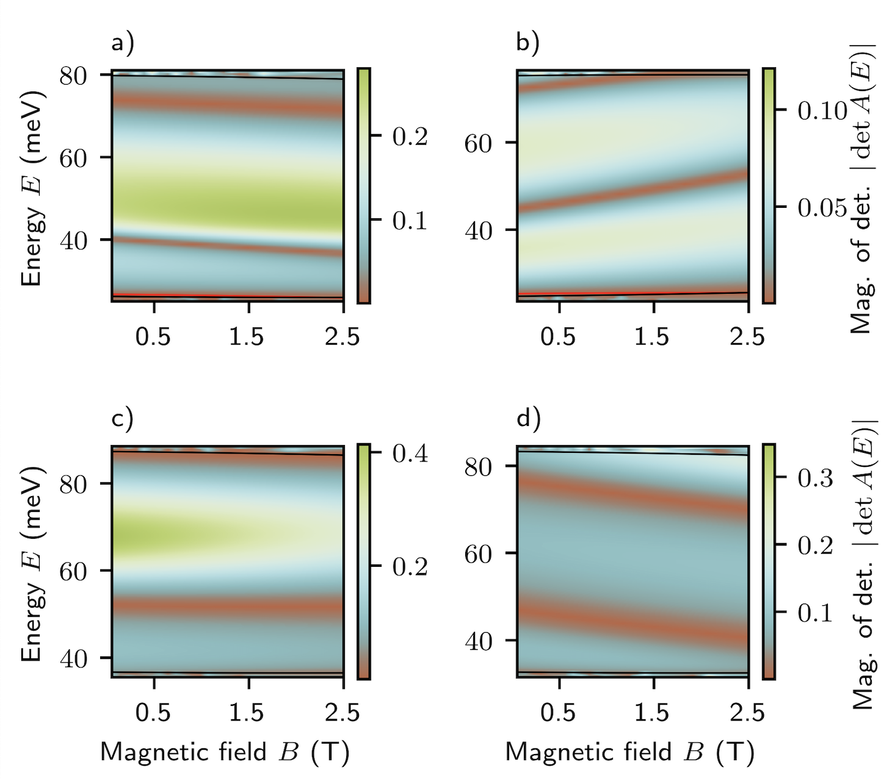

# Automated reconstruction of bound states in bilayer graphene quantum dots

A python library for calculating and plotting of energy spectra of Bilayer graphene quantum dots (BGQDs) and for the parametric optimization of bilayer graphene QD Hamiltonian with respect to experimentally measured data. The library was developed as a part of the work conducted in [[1]](#1).

## General functions for BGQDs

The bilayer graphene quantum dot system is in our work described with Hamiltonian 

$`\mathcal{H}=
\begin{pmatrix}
U(r) + \frac{\tau V}{2} & p_x + i p_y & t_{\perp} & 0 \\
p_x - i p_y & U(r) + \frac{\tau V }{2} & 0 & 0 \\
t_{\perp} & 0 & U(r) -\frac{ \tau V}{2} & p_x - i p_y \\
0 & 0 & p_x + i p_y & U(r) -\frac{ \tau V}{2}
\end{pmatrix}`$,

for detailed explanation see [[1]](#1). The single particle energy states as a function of magnetic field $`E(B)`$ are not calculated directly but are obtained as zeros of 2D determinant maps. 

<div>
<h4>Example of determinant maps</h4>

Our code implementation generates the output in the following form


</div>

Basic functions and routines for calculating the energy states and their dependence on magnetic field are placed in `./bilayer_libs` folder contaning:

- `det_funs.py`: contains functions necessary for determinant maps calculations
- `energy_lines.py`: extraction of energies from determinant maps
- `waveft_class_optim.py`: class for wavefunction calculation
- `classify_lines.py`: heuristics which distinguishes specific energy lines when there is more of them in a single determinant map (used in ground state search, works for U,V ~40-70 meV. For more generic usage, one needs to )
- `confluent.so`: dynamic library for faster evaluation of confluent hypergeometric functions (linux, OS X compatible option will be added)

#### Usage

To generate the 2D determinants, run:

```python
code example 1 appearing here soon
```

To extract energy spectra as a function of magnetic field `$E(B)$`, run:

```python
code example 2 appearing here soon
```

To to plot a radial part of bilayer graphene QD wavefunction, run:

```python
code example 3 appearing here soon
```

## Hamiltonian-guided random search (HRS)

A complete code example how to run HRS can be found in `CRS_Adjoint/CRS_Adjoint.py`

- routine to perform mixed global-local optimization for higher states (see the details in [[1]](#1))
- number of epochs of initial gradient descents can be specified as -e flag
- one can choose the dot (in the code or by flag -d)
- we use different notation for the dots CG2, CG3 and CG9 (compared to QD1, QD2 and QD3 used in the paper): CG2 = QD1, CG3 = QD2, CG9 = QD3
- `python CRS_Adjoint.py -e 20 -d CG3` (runs for QD2)

- code exits and creates folder with following structure:
    * `losses_global.csv`: contains losses of evaluated points
    * `UV_global.csv`: contains couple of parameters U,V of evaluated points
    * `results.csv`: contains all important output


## Ground state search with resolved Controlled Random Search with Local Mutations (CRS-LM)

A complete code example how to run CRS-LM based on a resolved domain can be found in `CRS_resolved_subdomain/CRS_resolved_subdomain.py`

- routine to perform resolved optimization on the subdomain of original domain
- it can be called more times at once to optimize over more subregions at once
- one can choose the dot (in the code or by flag -d)
- we use different notation for the dots CG2, CG3 and CG9 (compared to QD1, QD2 and QD3 used in the paper): CG2 = QD1, CG3 = QD2, CG9 = QD3
- in current setup, domains 50-70 meV for both $`U`$,$`V`$ are split to 5 subdomains along each axis, so 25 subdomains labeled by sU1 = {0,1,2,3,4}, sV1 = {0,1,2,3,4}
    * to optimize over $`U`$ = 66-70 meV, $`V`$ = 50-54 meV, run:  `python CRS_resolved_subdomain.py -sU1 4 -sV1 0 -d CG9` (runs for QD3)

- code exits and creates folder with:
    * `losses_global.csv`: contains losses of evaluated points
    * `UV_global.csv`: contains couple of parameters U,V of evaluated points
    * `results.csv`: contains all important output

## t-distributed stochastic embedding (tSNE)

A script to perform tSNE analysis of 2D determinant maps as shown in Fig.2(c) of [[1]](#1): `tSNE/tSNE.py`

## Bilayer graphene QDs and neural networks

Supervised training of a CNN architecture to extract continuous Hamiltonian parameters $`U,V`$ from 2D maps (see Appendix B of [[1]](#1)): `CNN/supervised_density_maps_training.py`

## Classification of spectral lines from 1D energy spectra $`E(B)`$

Multilayer perceptron training pipeline to infer angular momentum and valley number from magnetic field dependence of energy states (see Appendix D of [[1]](#1): `MLP/MLP_training/supervised_density_maps_training.py`. Moreover, codes for hyperparameter optimization (BOHB) are attached in `MLP/BOHB/`

## References
<a id="1">[1]</a> 
Bucko, J. et al. (2022). 
Automated reconstruction of bound states in bilayer graphene quantum dots
[arXiv:2203.00697](https://arxiv.org/pdf/2203.00697.pdf)

